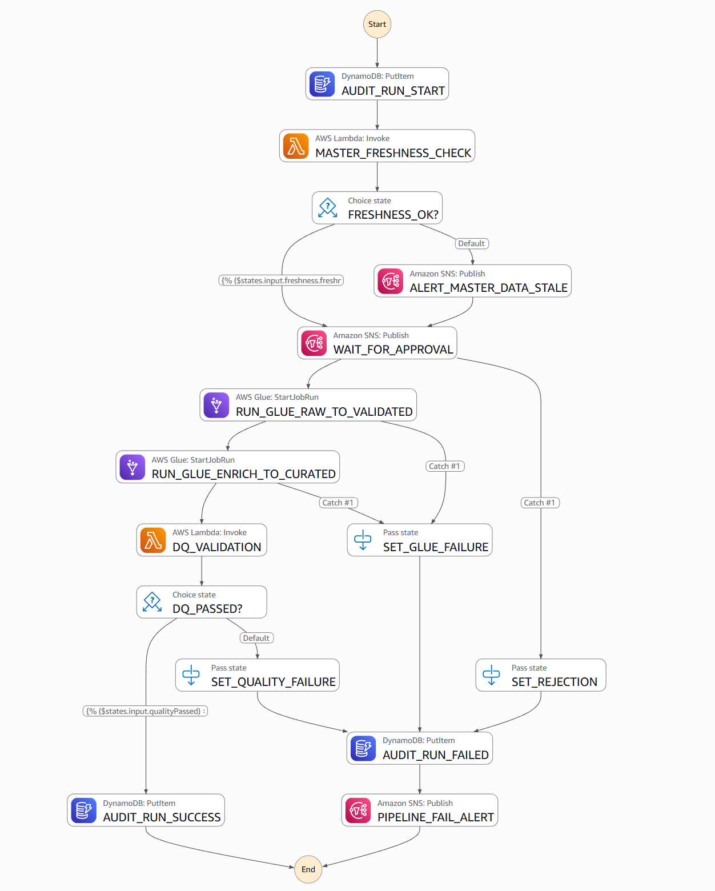
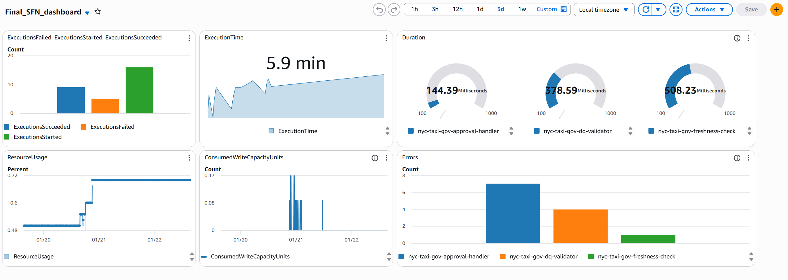
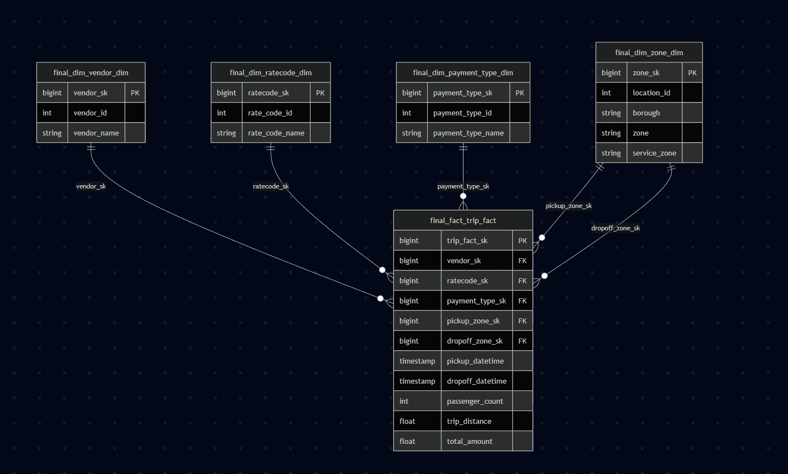
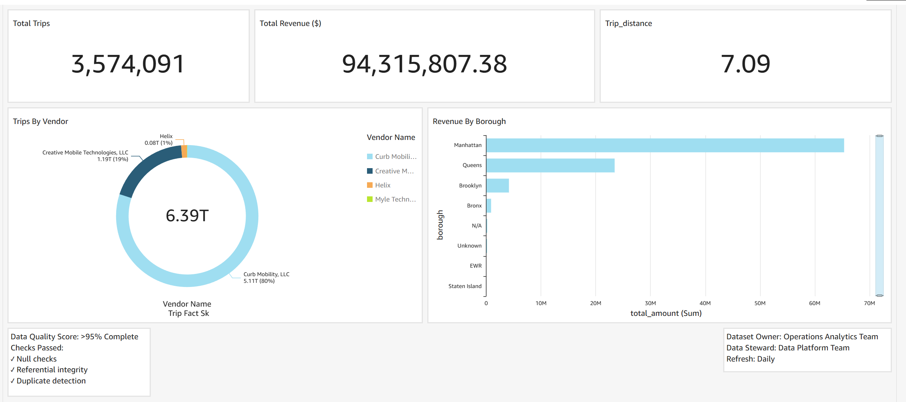

# NYC Taxi Governed Data Platform

## Architecture

## Overview

This repository contains an end-to-end **governed data platform** built on AWS, designed to demonstrate how enterprise-grade data engineering systems manage **data quality, approvals, lineage, and analytics readiness**.

The platform follows a **raw → validated → curated** data lifecycle and includes human-in-the-loop governance for master data, automated quality checks for transactional data, and full auditability of pipeline runs.

This project is intended for demonstration and presentation purposes and mirrors real-world patterns used in regulated data environments.

## AWS Architecture Flow

The platform operates in three main phases:

### 1. Master Data Governance
Master data (zones, vendors, rate codes) is steward-controlled and must be approved before use.

### 2. Transactional Data Processing
Trip data is validated, enriched using approved master data, and curated for analytics.

### 2. Downstream Analytics
Curated data is loaded into Redshift and Quicksight for analytics

## End-to-End Pipeline Flow

### Step 1: Raw Ingestion
- Raw master data and trip data are ingested into the **raw layer**
- Data is stored exactly as received, without transformations
- Raw data is immutable and retained for audit purposes
- The file upload triggers an event and updates the steward for master data flow

### Step 2: Master Data Stewardship
- The Event takes the data in the file and applies matching logics(Levenstien) and uploads data to RDS
- Master data is loaded into a relational store for review
- Steward applies corrections, resolves duplicates, and approves changes
- Approved records become **golden records**
- Golden records are published as immutable snapshots into the validated layer

This ensures only steward-approved master data can be used downstream.

### Step Function

### Step 3: Freshness & Approval Gate
- A pipeline execution begins with a freshness check on the latest master snapshot
- If the snapshot is stale, an approval request is sent
- The pipeline waits until a steward explicitly approves or rejects the run

This prevents analytics from using outdated reference data.

### Step 4: Raw → Validated (Quality Enforcement)
- Raw trip data is processed by a Glue job
- Schema validation and null checks are applied
- Invalid records are isolated
- Valid records are written to the validated layer

This creates a clean, standardized version of transactional data.

### Step 5: Validated → Curated (Enrichment)
- Validated trip data is enriched using the latest golden master snapshot
- Pickup and dropoff zones are joined
- Business-ready fields are added
- The curated dataset is written for downstream consumption

This layer is optimized for analytics and reporting.

### Step 6: Data Quality Validation
- Quality metrics are generated during enrichment
- Metrics are evaluated against thresholds
- The pipeline succeeds or fails based on data quality
- All results are logged for audit and governance review

### Step 7: Audit & Lineage
- Each pipeline execution is logged with start and end status
- Approval decisions are recorded
- Quality outcomes are captured
- Metrics are stored for monitoring and reporting

This provides complete traceability of every dataset.

### Cloudwatch Dashboard

### Step 8: Analytics Enablement
- Curated data is loaded into analytical stores
- Loaded into redshift using COPY command and Glue data catalog external tables 
- Dimension and fact models are built
- Dashboards are created using curated data only
- Business users access trusted, governed data

### Data Model (ERD)

### QuickSight Dashboard

## Security and CI/CD
- Created least privilage IAM roles and policies for aws services
- AWS secrets manager to create key secrets for RDS
- Deployed the services to AWS using Terraform and Github Actions

## Governance Principles

This platform demonstrates the following enterprise governance principles:

- **Separation of concerns** between raw, validated, and curated layers
- **Human approval gates** for master data
- **Automated quality checks** for transactional data
- **Immutable snapshots** for reproducibility
- **Audit-first design** for compliance
- **Least privilege access** for all workloads

## Repository Structure (Logical)

- **Infrastructure** – Terraform code for provisioning AWS resources
- **Pipelines** – Glue and Lambda implementations
- **Governance** – Approval flows and audit logic
- **Analytics** – SQL models and dashboards
- **Documentation** – Architecture, governance, and flow descriptions

---
